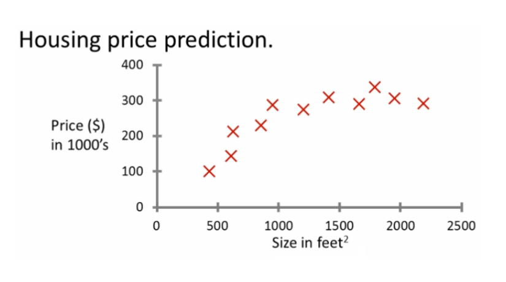
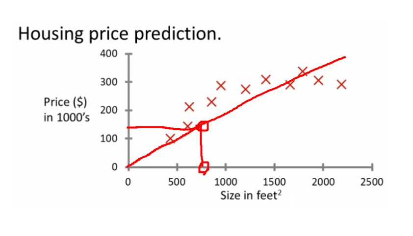
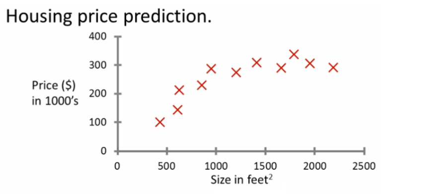
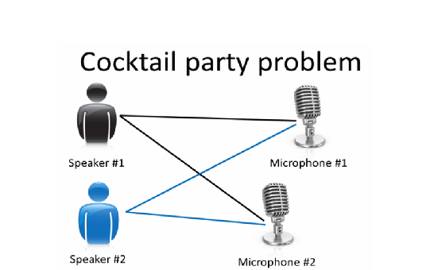
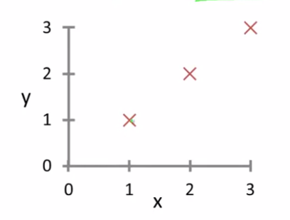
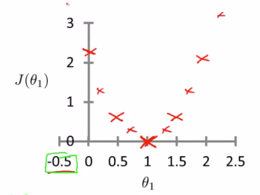
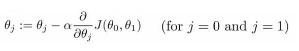
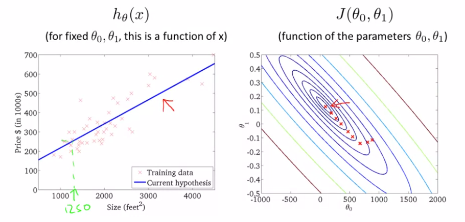

# 01 and 02: Introduction, Regression Analysis, and Gradient Descent

### 머신러닝이란?

* Arthur Samuel(1959) : "컴퓨터에게 명확하게 프로그램시키지 않아도 학습할 수 있는 능력을 주는 연구분야 이다."
* Learning algorithms의 종류
  * Supervised Learning -> 컴퓨터에게 정답을 알려주어 학습시키는 방법
    * ex) input으로 개(dog) 사진을 주고, 이 사진은 개(dog)라고 label된 데이터를 주어 학습
    * 분류(classification),회귀(regression) 로 나뉜다
  * Unsupervised Learning -> 컴퓨터에게 정답을 알려주지 않고 학습시키는 방법
    * ex) input으로 여러 동물 사진을 주고, 각 input등에 대한 특징을 찾아 분류
    * 다리가 4개인동물, 꼬리가 달린 동물, 수염이 있는동물 등으로 분류

### Supervised Learning- 개요

* 집의 가격을 예측하는 문제 : "주어진 데이터로 친구가 750 square feet size의 집은 가격을 얼마로 예상할 수 있는가?"

  

* 직선을 그려 해당하는 가격을 예측하는 방법을 사용할 수 있다

* 대락 $150으로 예측이 가능하다

  #### 회귀분석(Regression)

  * 회귀분석은 연속적인 값을 갖는 결과 값을 예측하는 것
  * 입력값에 대응하는 결과값을 분석하여서 연속적인 함수를 찾는 과정

  ### 분류(Classification)

  

  * 위의 그래프에서 종양의 크기에 따라 0아니면 1로 분류되어 있다
  * 입력값에 대응하는 결과값을 분석하여서 이산적인(Discrete) 값을 찾는 것이다
  * 꼭 0과 1이 아니더라도 이산적인 값으로 분류되면 모두 분류(Classification) 문제이다

## **Unsupervised learning - introduction**  

* 지도학습 과는 다르게 정답이 주어지지 않는다
* Input 에 대한 output의 label이 존재하지 않을 때, Data Set을 Cluster하는 학습이다
* ex) Cocktail party problem

## **Linear Regression**-Notation

* Training Set : 훈련에 필요한 데이터 집합

* m : training examples 의 개수

* x's : 입력 값 variables / features

* y's : 출력 값 variables / "target " variables

  * ​	(x,y) - 단일 training 예제
  * ​    (xi,yi) -  i번째 training 예제

* Algorithm outputs a function (h = hypothesis)

  * ​	가설함수의 input값을 넣어 y값을 예측하는데 쓰이는 함수
* h$\theta$  = $\theta$ 0  + $\theta$ 1x  => ==univariate linear regression==  

## Linear regression - implementation (cost function)

* cost function으로 어떻게 하면 최적의 직선을 데이터에 맞출수 있는지를 알 수 있다

* 가설함수 h$\theta$  = $\theta$ 0  + $\theta$ 1x  의  $ \theta $0 와 $\theta$1 의 값을 우리가 원하는 데이터에 맞게 결정해 줘야 한다

* 즉, h$\theta$  - y 의 값을 최소로 하는 것이 목적인데 음수가 나오는 것을 방지하기 위해  (h$\theta$  - y)2 으로 구한다

* MSE(Mean Square Error) 
  $$
  Cost\ Function =J(\theta0,\theta1)=\frac 1 {2m}\sum\limits_{i=1}^{m}(h(x^i) - y^i)^2
  $$

* 현재 모델이 주어진 데이터를 얼마나 잘 설명하고 있는지 알기 위해 Cost Function을 사용한다
* 즉, 최종적으로 Cost Function이 최소가 되는것을 목표로 한다

### <Cost Function 의 이해>

{:.left} {:. right}

* 만약 training data가 (1,1) (2,2) (3,3) 으로 주어졌다고 하자.

* 가설함수를 간단히 하여 $\theta$0 가 0 이라고 하자.

   즉 h(x) =  $\theta$ 1x 로 원점을 지나며  $\theta$ 1 에 따라 기울기가 변하는 모양의

  모델이 된다.  J($\theta$ 1) = 1 일때, 0일때, 0.5, 1, 1.5, 2, 2.5 를 오른쪽 그림처럼 x로 표시하면

  $\theta$ 1이 1 일 때 가장 값이 작게 나오고 이 때의 접선의 기울기 값이 0인 것을 알 수 있다. 앞으로 이 값을 찾는 것을 목표로 할 것이며 

  후에 ==Gradient Descent Algorightm==을  이용하여 기울기 값이 0에 가까운 것을 찾을 것이다.

## **Gradient descent algorithm**

* Cost Function을 최소로 만드는 파라미터를 구하는 알고리즘

  

* $ \theta $ 를 $\alpha$(학습속도) x (Cost Function을 $\theta$ 에 대해 편미분 한 값) 을 빼주면서 점차 Cost function이 최소화 되는 $\theta$ 값을 찾는 알고리즘

* 이 때, 각 $\theta$ 는 동시에 업데이트 해야 하는 것에 주의한다

* 오른쪽 그래프에서와 같이 파라미터들을 조정해나가며 가설함수가 데이터에 fitting 되고 있는 것을 볼 수 있다

   이렇게 Cost Function을 최소화 하면서 파라미터들을 조정해 나가는 알고리즘이 바로 '경사 하강법(Gradient Descent Algorithm)' 이다.

### Gradient Descent in Practice I - Feature Scaling

* 여러 개의 feature가 있을 때 그 feature들의 단위크기가 비슷할 때 Gradient Descent 가 더 빠르게 수렴한다는 아이디어
* Mean Nomalization 방식을 사용하여 Scaling 하는 방법이 있다.

### Gradient Descent in Practice II - Learning Rate

* Gradient Descent 의 속도를 조절할 수 있다

* 만약 Learning Rate 가 너무 작으면 기울기가 감소하는 속도가 너무 느려 원하는 답까지 수렴하는데 오랜시간이 걸릴 수 있으므로

   Learning Rate 값을 조정해야 한다.

* 반대로 Learning Rate의 값을 너무 크게 해버리면 optimal 값을 정확히 찾지 못하는 단점이 있으므로 경사하강이 진행하는 그래프를 보며

  조금씩 조절을 해야 한다.

## Normal Equation

* 경사하강법을 적용하지 않고 한 번의 실행으로 최적의 답을 구하는 방법이다
  $$
  \theta = (X^TX)^{-1}X^Ty
  $$
  

