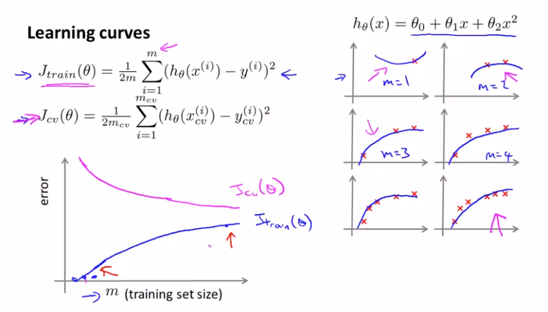

# 10: Advice for applying Machine Learning

이제까지 다양한 학습 알고리즘을 배웠고 앞으로는 이 학습 알고리즘을 효과적으로 적용하는 방법에 대해서 공부해 보겠다.

집값을 예측하는 문제를 Regularized Linear Regression을 사용할 때의 Cost Function이다. 집값 예측에 대한 성능을 향상시키거나 문제가 발생할

경우 생각할 수 있는 방법은 아래와 같다

* Training example을 더 많이 얻는것

* Try smaller sets of features

* Try getting additional features

* Try adding polynomial features

* Try decreasing / increasing $\lambda$

  일반적으로 위와 같은 방식들 중 직관적으로 골라 적용하게 될 것이다. 하지만 그 선택이 원하는 결과를 반환하지 않을 경우가 생길 수 있다

  이러한 시간낭비를 줄이기 위해서 앞으로 Machine Learning Diagnostic 이라는 것을 배울 것이다. 이는 알고리즘이 제대로 동작하는지 하지 못하는지 진단을

  해준다 하여 이 같은 이름으로 불리운다. 이 방법을 사용했을때, 시간을 단축시킬 수 있을 것이다. 궁극적인 목표는 기계 학습 시스템을 개선하는 것이다

## Evaluating a Hypothesis

 

* 가설함수를 평가하기 위해 위의 그래프 처럼 함수를 직접 그려서 판단하는 방법이 존재한다.
* 하지만 만약 이보다 훨씬 많은 features가 존재한다면 직접 그려서 확인하는 것은 너무 복잡한 일일 것이다.

위와 같은 Data Set이 존재할 때, 먼저 70%,30% 비율로  두 개의 부분으로 나눈다

* Data Set 70% : Training Set(학습용 데이터) 
* Data Set 30% : Test Set(테스트용 데이터)

학습용 데이터는 말그대로 학습을 위한 데이터로, 70%의 크기로 학습을 진행하고 그 이후 과적합에 대한 문제를 판단하기 위하여

raw data인 나머지 30% 테스트용 데이터로 성능을 검사하는 방식이다.

이 둘간의 관계는 다음과 같이 표현할 수 있다.

* Data Set 의 J($\theta$) is low, Training Set 의 J($\theta$) is high = Overfitting
* Data Set 의 J($\theta$) is low, Training Set 의 J($\theta$) is low = Just right

## **Model selection and Training/Validation/Test sets**

### Model Selection

먼저 model을 선택하는 방법에 대해서 알아보겠다. 위의 10개의 모델이 있고 각각의 모델은 d(degree of polynomial) 다항식의 차수로 1~10 까지의

모델이 주어져 있고 우리는 이 모델 중에 어떤 모델이 가장 좋은 model이 될 수 있는지 판단해야 한다.

그렇다면 각각의 가설 함수에 대해 $J_{test}$($\theta$) 값을 구해 그 중 가장 min한 J를 갖는 모델을 선택하는 방법이 직관적일 것이고 이는 꽤 합당한 방법이라고 

느껴진다. 하지만 이 방법은 또한 Test set 에 대한 과적합의 문제가 발생할 수 있는 가능성이 있기 때문에 실제로 우리는 다른 방법을 사용하여 모델을 선택한다.

이번에는  Data Set 을 총 세부분으로 나누었다

* Data Set 60% : Training Set(학습용 데이터) 

* Data Set 20% : Cross Validation Set(유효성 검사용 데이터)

* Data Set 20% : Test Set(테스트용 데이터)

  이와 같이 나누어 각각의 모델을 Cross Validation Set에 대한 J($\theta$) 로 가장 min 한 모델을 골라, 새로운 $J_{test}(\theta)$ 로 평가하여 선택한 모델이 좋은 선택인지

  아닌지 예측을 하여 채택하는 방식을 이용하면 아까와 같은 일반화의 문제를 해결할 수 있다

## Diagnosing Bias vs. Variance

* High bias  = 가설함수가 simple하여 생기는 underfit 문제
* High variance = 가설함수가 너무 complex하여 생기는 overfit 문제

 polynomial 의 차수가 증가함에 따른 error의 그래프를 그려보았을 때, 다음과 같이 두 개의 그래프로 나오는 것을 알 수 있다.

* 만약 Train cost function은 높고, 유효성 검사 cost function의 값도 비슷하다면 이 문제를 Bias(underfit) 에 대한 증거로 볼 수 있다.
* 반대로 Train cost function은 낮고, 유효성 검사 cost function의 값이 Train cost function 값보다 훨씬 크다면 이것은 Variance(overfit) 에 대한 증거로 볼 수 있다.

   즉, high bias 문제는 training set의 가설이 잘 맞지 않는 것을 알 수 있는것이고 high variance 문제는 test set에 가설이 잘 맞지 않은 것으로 진단을 할 수 있다.

## **Regularization and bias/variance**

다 차원의 polynomial Model에서 우리는 Overfitting 문제를 해결하기 위해 정규화를 사용하였다. 정규화 계수인 $\lambda$ 가 너무 작을 때와 너무 클 때를 보면

* $\lambda$ is Too Large : 높은 페널티 덕에 대부분의 $\theta$ 들의 크기가 0에 가까워 질 것이고 그럼 underfitting 문제 즉 High bias 문제가 생기게 된다.
* $\lambda$ is Too Small : 낮은 페널티로 대부분의 고차 $\theta$ 들의 크기가 큰 값을 유지할 것이고 overfitting 문제 즉 Higg variance 문제가 생기게 된다.
* $\lambda$ is intermediate : 적당한 람다 계수를 찾게 되면 가장 적절한 모델이 된다

그렇다면 람다 계수의 적절한 값의 모델을 선택하는 방법에 대해서 알아보자

12개의 모델의 람다 값이 전부 다를 때의 어떤 람다 계수를 구해야 좋은 모델을 선택하는지에 대한 방법은 다음과 같다.

* 우선 각각의 모델을 Cost function을 최소화 하는 theta 값을 구한 뒤
* 그 중 가장 작은 cost function의 모델을 골라 유효성검사 데이터 셋의 비용함수를 계산하여 가장 좋은 모델을 선택한다
* 마지막으로 Test set에서도 잘 돌아가는지 비용함수를 다시 한 번 계산해보고 일반화 문제가 발생하는지 확인하여 검증을 한다.

## Learning Curves

Learning Curves 는 알고리즘의 성능을 향상시키기 위해 bias,variance 문제에 발생하는지 안하는지를 체킹하는 방법으로 그래프를 그려 확인 할 수 있다.

우선 m(학습 데이터 의 사이즈) 의 크기에 따른 error그래프를 그려본다면, $J_{train}(\theta)$ 와 $J_{cv}(\theta)$ 에 관계를 나타내면

* m의 크기가 작은경우 당연히 $J_{train}(\theta)$ 이 작게 나온다. 그에 비해  $J_{cv}(\theta)$ 의 값은 크게 나온다.
* m의 크기가 커지는 경우  $J_{train}(\theta)$  값은 커지지만 학습을 진행하면서 $J_{cv}(\theta)$  값은 줄어들 것이다

이러한 관계를 표현하면 위와 같이 두 개의 curves 가 그려진다.

### High bias

위에서 Learning curves의 모양을 배웠는데, High bias인 경우에는 어떤식으로 그래프가 그려지는지 확인하여 보겠다.

* high bias이기 때문에 m이 늘어날수록 J train 의 값은 커질것이고, 학습이 되어 J cv 값은 어느정도로 줄 것이다.
* 다만, 이러한 문제에서는 일정 크기 이상의 Training set에 대해서는 size가 커지더라도 효과가 없을 것이다

### High Variance

* High Variance는 train error는 커지며 test error가 감소하지만 둘 사이의 gap이 커지는 것을 알 수 있다.
* 이러한 개형의 learning curves 가 보이면 overfitting 의 문제가 발생했다는 것을 인지하고 해결책을 찾아야 할 것이다.

