# 12: Support Vector Machines (SVMs)

### **Support Vector Machine (SVM) - Optimization objective**

이제까지 배웠던 알고리즘들의 성능적으로 차이가 크지 않았다는 것을 알 수있다.

이제부터 non-linear function을 처리하는데 강력한 알고리즘인 Support Vector Machine을 배워볼 것이다.

### **An alternative view of logistic regression**

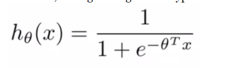

logistic regression 에서 사용하던 가설함수의 형태는 위와 같다. 우리는 이 가설함수를 변형하여 새로운 SVM의 가설함수와 Cost function 에 대해서 설명할 것이다.

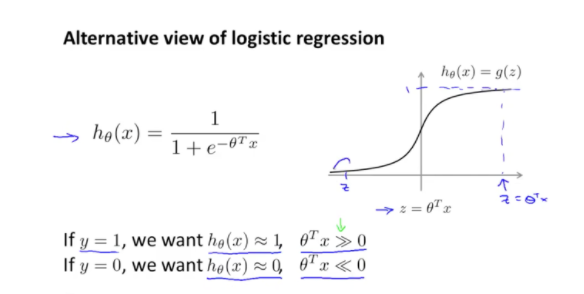

logistic regression의 그래프는 다음과 같으며, z가 0보다 클때 output이 1에 가까우며 그렇지 않으면 output이 0에 가까워 지는 것을 확인할 수 있었다. 즉 y=1 일떄는, h(x) 가 1에 가까워야 하고, 그에 따라 z값이 0보다 커야했고 y=0일때는, h(x) 가 0에 가까워야 하고, 그에 따라 z값이 0보다 작으면 y=0이라고 예측을 했었다.

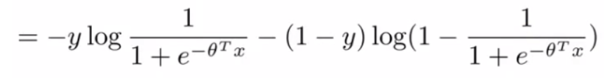

이전에 logistic regression에서 사용하던 cost function이다. 총 두부분으로 이루어져 있고 y=1일 때는 앞부분만이 남게되고, y=0일때는 뒷부분만이 남게되어 두 가지 경우를 하나의 식으로 통합해서 한줄로 사용하였다.

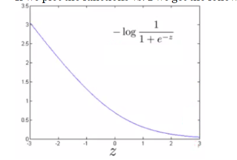

y=1일때의 그려지는 cost function의 모습이다.

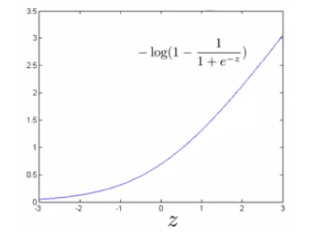

y=0일때의 그려지는 cost function의 모습이다.

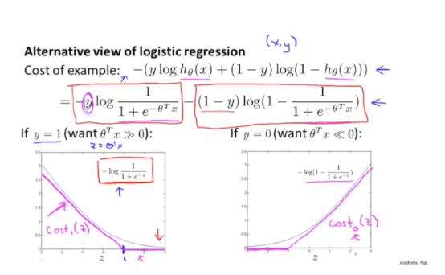

SVM의 Cost function을 정의하기 위해서 우리는 각각 y=1,y=0 일때의 그래프를 분홍색 선으로 그려져 있는 직선형태의 그래프를 볼 수 있다.

* y=1일 때, z가 1이상이면 cost가 0, we want h(x) >=1
* y=0일 때, z가 -1이하이면 cost가 0, we want h(x)<=-1

이 두개의 새로운 cost function을 각각 $cost_1(z)$, $cost_0(z)$ 로 정의하겠다.

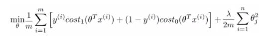

새롭게 적용한 cost function은 위와같지만, 여기에서 우리는 양쪽 1/m을 생략할 수 있음을 알아야 한다. 왜냐하면 우리는 위의 식을 이용해 $\theta$ 가 min 한 값을 찾게 될 것인데, 양쪽의 1/m의 값 즉 상수값은 똑같이 곱해지거나 똑같이 생략하여도 같은 $\theta$ 는 똑같은 min한 값을 갖게 될 것이기 때문이다. 

그리고 SVM의 cost function과 logistic regression의 cost function의 또 다른 차이점이 있다.

* Logistic regression : A + B * $\lambda$ 
* SVM : C * A + B  (C 는 1/$\lambda$ 의 값과 비슷한 값)

이렇게 해서 최종적으로 완성되는 SVM의 cost function은 다음과 같다.

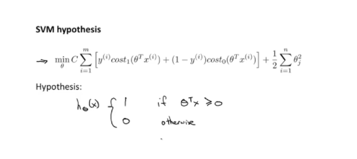

방금전에 정의한 함수를 다시한번 그려보게 되면 아래과 같이 그릴 수 있다

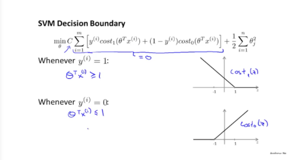

만약 C의 값이 엄청 크면 cost1, cost0이 둘 중에 한 부분은 0이 되어야 할 것이다.

만약 y=1일 때는, z>=1 이어야 하고 y=0 일때는 z<=-1 이어야 cost가 각각 0이 되는 것을 알 수 있다. 아까 위에서 정의한 가설함수의 범위보다 제대로 그래프를 그려 확인해 본 결과 둘 사이의 gap이 생긴 것을 알 수가 있다.

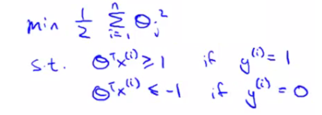

그렇게 앞의 부분이 0으로 없어지고 나면 공식에서 남는 부분은 위의 식과 같다.  이 공식은 결국 decision boundary가 되는데 우선 다음 여러개의 decision boundary 중 어떤 것이 더 좋은 decision boundary인지 생각해보자.

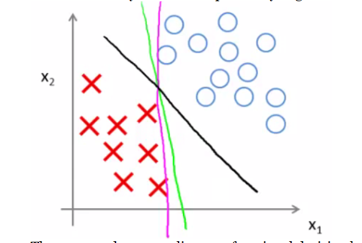

세 직선 모두 두 개의 data set을 classification 해주는 decision boundary임은 틀림이 없지만 

새로운 데이터가 들어왔을 때 더 예측할 수 있는 성능이 좋은 직선은 검은색 직선이다. 그 이유는 

바로 data들 간의 margin 이라 불리는 쉽게 말해 decision boundary와 데이터 간의 distance 의 차이가 클 수록 좋은 classifier 라고 할 수 있고, 이러한 decision boundary를 찾아내는 알고리즘이 바로 svm 알고리즘이며 또한 이 알고리즘이 Large margin Classifier 라고도 불리는 이유이다.

## **Large margin classification mathematics (optional)**

### **Vector inner products** 

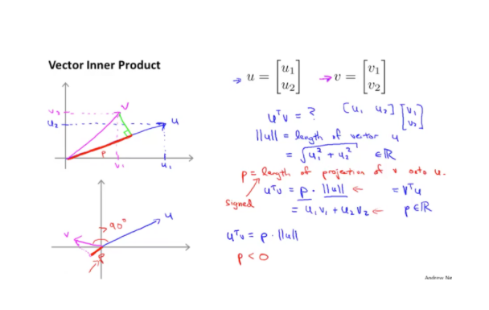

Large margin classification을 이해하기 위해 수학적인 개념들 몇가지를 공부하고 넘어가야 한다.

우선 두 벡터의 inner product 에 대해서 알아보겠다. 2 x 1 크기의 u 벡터와 같은크기의 v 벡터 두 벡터간의 내적(Inner product)를 한다면, 우선 두 벡터를 그래프 상에 표현한다. 후에 v벡터를 u벡터에 수직으로 projection해서 생기는 길이를 p라고 정의하고 우리가 원하는 두 벡터간의 내적의 결과는

바로 p x ||u|| (||x|| 는 norm 이라고 읽고 벡터 x의 길이를 의미한다) 이렇게 된다.

이 때 p의 값은 두 벡터간의 사이각이 90도 이하일 때는 양의 값, 90도 이상인 경우는 음의 값을 가지게 된다.

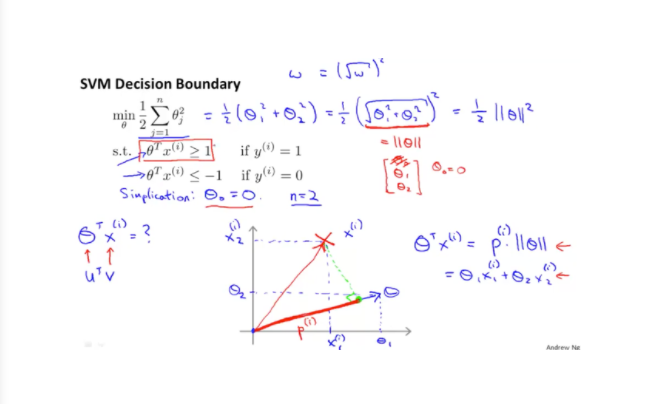

이제 이것을 이용해 svm의 decision boundary을 생각해 보겠다. 우선 우리는 C값의 값이 커저셔 A

부분 즉 cost1,cost0 값이 0이 되어 남은 부분이 B만 있는 경우로 가정하고 시작하겠다. 남은 식을 일반화 하면 ||$\theta$|| 값으로 일반화 할  수 있는것을 알 수 있고, 우리의 가설함수 $\theta^T$x 를 각각의 벡터라고 생각하여 이전에 배운 벡터의 내적으로 표현하면 p dot ||$\theta$|| 로 표현할 수 있다.

여기에서 알 수 있는 사실은 아래와 같다.

* y=1일 때, 가설함수는 1보다 크거나 같아야 하고 또한 p dot ||$\theta$|| >=1 라고 쓸수 있다.
* y=0일때, 가설함수는 -1보다 같거나 작아야 하고 또한 p dot ||$\theta$|| <=-1 라고 쓸수 있다.

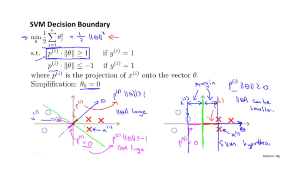

외쪽 그래프와 같이 data set과 decision boundary간의 거리가 짧은 경우 p의 값이 짧게 만들어지는 것을 알수 있고, 반대로 data set과 decision boundary 간의 거리가 충분한 경우 p의 값이 상대적으로 더 길게 나오는 것을 알 수 있다.

#### p의 값이 작은경우

* y=1일 때, p의 값이 작기 떄문에 ||$\theta$||의 값이 커야함.
* y=0일때, p의 값이 작기 떄문에  ||$\theta$||의 값이 커야함.

#### p의 값이 큰 경우

* y=1일때, p의 값이 크기 때문에 ||$\theta$||의 값이 작음.
* y=0일때, p의 값이 크기 때문에 ||$\theta$||의 값이 작음.

즉, p의 값은 곧 margin이라고 할 수 있고 이 margin이 큰 decision boundary가 더 좋은 것인 것을 알아보았고, 수학적으로 어떻게 margin이 생기게 되는지에 대해 공부하였다.

## **Kernels - 1: Adapting SVM to non-linear classifiers**

이번에는 non-linear한 classifiers에 대해 알아보겠다.

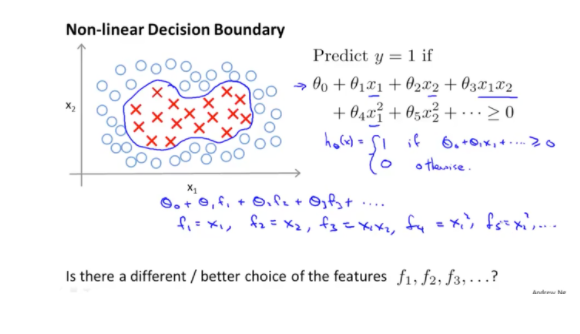

위와 같이 data set들이 분포해 있는 경우 linear한 decision boundary로는 해결하기는 불가능해 보인다. 즉 non-linear 한 경계로 구분을 지어야 한다. 위의 예시에서 주어진 가설함수가 위처럼 주어져 있을 때 우리는 $$\theta$$ 와 곲해지는 x들을 f라는 이름으로 새롭게 치환을 해보겠다.여기에서 f는 x,l의 similarity 함수라고 부른다.

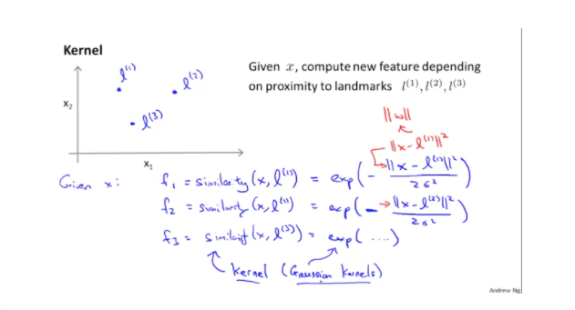

우선, 그래프에 임의의 점을 세 군데 찍고 그 값들을 각각 l1, l2, l3 (l = landmark) 라고 하겠다.

f는 x와 l의 유사성을 나타내는 함수이고 그 식은 위의식처럼 정의하겠다. 이 f함수를 kernel이라고 부르고, 우리가 사용하는 kernel은 Gaussian Kernel이라 하고 f1 =k(x,l1) 과 같이 작성할 수 있다.

이 식에서 알 수 있는점은 x와 l의 유사성 즉 거리가 가까울 수록 분자인 거리의 차는 0값에 가까워지고 0값이 되면 $e^0$ =1이며, f는 1의 값을 갖는다. 또한 두 값간의 거리가 멀면 분자의 값이 엄청나게 커지고 굉작히 작은 0에값에 가까워 지는 특징이 존재한다.

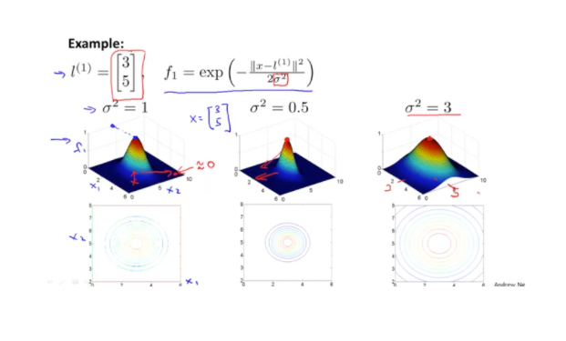

이 세가지 그림은 같은 x,l 의 값에서 $\sigma^2$ 의 값에 따라 생기는 등고선의 경사도를 표현한 것이며

그 값이 클수록 경사도는 낮아지고 그 값이 크지 않은 경우에는 더 날카로운 등고선이 된다라는 것을 알 수 있습니다.

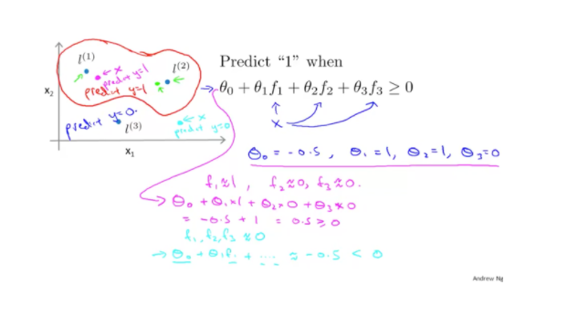

위의 그림은 1를 예측할때, 가설함수와 theta값에 대해서 정의되어 있다. 각각의 쎄타가 위와 같이 정의되어 있다고 하자. 분홍색 점은 l(1) 과 가까이 위치해 있고, f1 은 1에 가까운값이 계산이 될 것이고 나머지 f2,f3는 0에 가까운 값이 될 것이다. 그렇게 계산한 결과 0.5로 0보다 큰 값이 나와 1의 값으로 예측이 되어지는 것이다. 이와같이 계산을 할 수 있고 위의 빨간색 테두리처럼 non-liner한 decision boundary가 형성이 되는 것이다. 지금의 예시는 landmark 3개 를 표시하여 예시를 들었지만 실제로는 data set의 개수만큼 landmark를  생성한다.

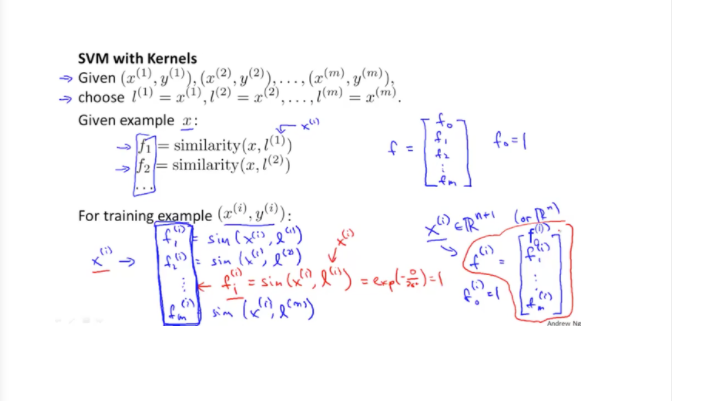

landmark는 x의 값과 정확히 같은 값들을 선택하는 방식을 사용한다.

f를 하나의 벡터로 만들면 f의 총 크기는 f0=1을 추가하여 m+1개의 크기를 가진다.

이는 x의 개수와 l의 개수가 같기 때문에 만들어지는 결과이다.

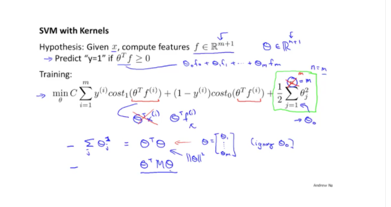

### Bias, Variance trade off

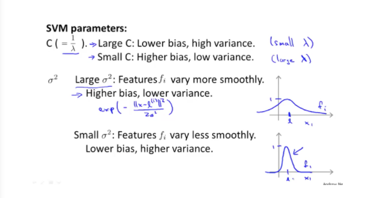

SVM은 C의 값과 $\sigma^2$ 의 값을 조절하여 bias, variance 문제를 해결할 수 있는데. 그 관계는 다음과 같다.

* C is large, Lower bias, high variance(overfitting)
* C is small, Higher bias, low variance(underfitting)

즉 C의 값을 적절히 조절하여 더 좋은 알고리즘을 만들 수가 있게 된다.

또한 $\sigma^2$ 의 값의 관계를 보면

* $\sigma^2$ is large, f의 그래프가 좀 더 smoothly 하게 그려진다
* $\sigma^2$ is small, f의 그래프가  덜 smoothly 하게 그려진다

두가지 하이퍼 파라미터를 조절하여 더욱 좋은 알고리즘을 만들 수 있음을 알아보았다.

## **SVM - implementation and use**

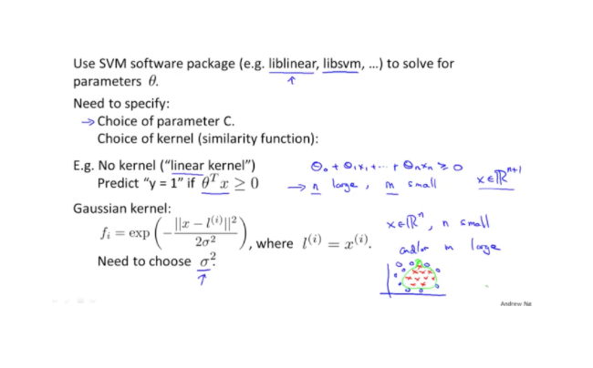

실제 svm을 사용할 때, parameters $\theta$를 구하는 것은 software package로 잘 구현되어 있기 때문에 그 라이브러리를 사용하면 된다.

그리고 우리가 골라야 할 것이 두 가지가 있는데, parameter C 와 kernel을 골라야한다.

kernel은 간단하게 두 가지로 분류할 수 있는데 각각의 특성은 다음과 같다.

* linear kernel(No kernel) : kernel을 사용하지 않는 경우로, 주로 feature n 이 크고 m은 작은 경우에 사용하는 방법이다.
* Gaussian kernel : 앞에서 배운 f function을 사용하는 kernel로 주로 n이 작고 m이 큰 non-linear 한 경우에 사용하는 가장 유명한 kernel 중 하나이다.

참고로 Gaussian kernel을 사용할 때, feature들의 값이 크기 차이가 많이 난다면 scaling을 해 주어 단위를 비슷하게 만들어 사용하는 것이 좋다.

### **Multi-class classification for SVM**

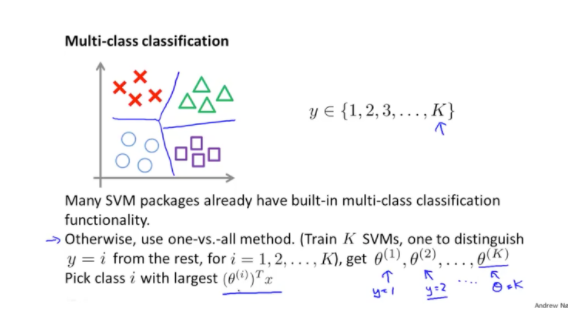

svm도 이제까지와 마찬가지로 multi-class classification이 가능하다. 방법은 y의 label 수만큼 

$\theta$ 를 사용하며 one vs all 방식으로 진행한다. 이 때 각 $\theta$ 는 y의 값과 매칭이 된다.

### **Logistic regression vs. SVM**

Logistic regression을 사용할지 SVM을 사용할지는 features의 수 n과 data set의 수 m에 따라서 알고리즘을 결정하면 좋다. 이들을 분류하자면 아래와 같다.

* n이 m에 비해서 큰 경우 : logistic regression or svm linear kernel사용. (n=10,000, m=10~1000)
* n은 작고 m은 중간 정도 : SVM Gaussian kernel 사용. (n=1~1000, m=10~10,000)
* n이 작고 m이 엄청 클떄 : logistic regression or svm linear kernel사용.(m이 엄청 클 때는 Gaussian kernel이 효율이 안나오기 때문이다)

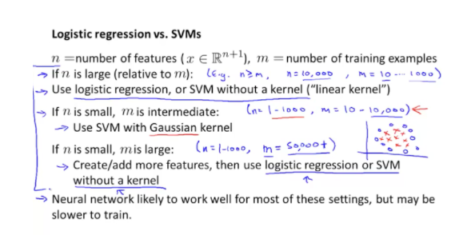
