# 13: Clustering

## **Unsupervised learning - introduction**

이제까지는 정답을 주어주고 그 정답을 예측하는 것에 중점을 둔 문제인 supervised learning 에 대해서 배웠었다. 이번에는 정답을 주어주지 않는 data set에 대해서 자율적으로 분석하여 연관있는 것들끼리 구분짓는 방식의 머신러닝 기법인 unsupervised learning(비지도학습) 을 배워 볼 것이다.

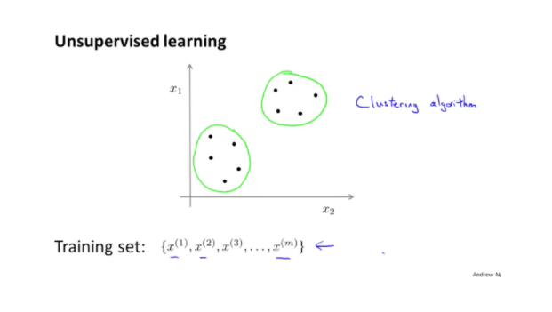

위와 같이 data set들은 모두 같은 모양으로 이루어져 있어 데이터간의 연관성의 대한 정보는 주어져있지 않다. 이 그림에서는 현재 비슷한 군집끼리 묶어놓았는데, 이러한 알고리즘을 clustering algorithms 이라 한다.

## **K-means algorithm**

k-means 알고리즘에 대해서 설명하기 전에 비지도학습의 학습과정에 대해서 먼저 이야기하겠다.

* 우선 Cluster Centroids은 두 개의 cluster를 구성하는 중심점 역할을 하는 임의의 point라고 말할 수 있다. 비지도학습에서의 첫 번째 동작은 임의의 Cluster Centroids를 위치시키는 것이 첫 번째 동작이다.
* 두 번째로는 이 임의의 Centroids들을 이동시키면서 data set을 적절히 구분지어 가는 과정이 된다. 

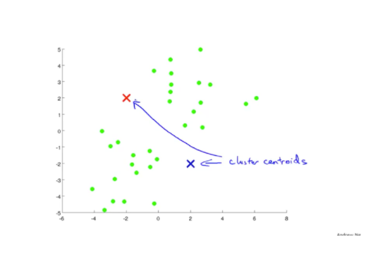

두 개의 centroids를 임의로 위치 시킨후에 그 중심을 이동시키며 학습한 결과로 data set을 구분하는 과정을 보여준다.

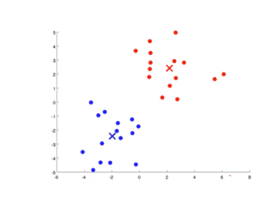

결과적으로 Clustering 이 완료된 모습이다.

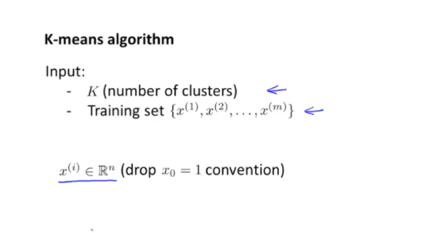

이제부터 k-means algorithm 에 대해서 설명하기에 앞서서 input으로 어떠한 값이 들어오는지에 대해 정리해보겠다.

* k = clustering 될 수를 의미한다.
* Training set = 훈련용 데이터 x를 입력으로 받는다.(비지도 학습이기 때문에 정답은 주어지지 않음)

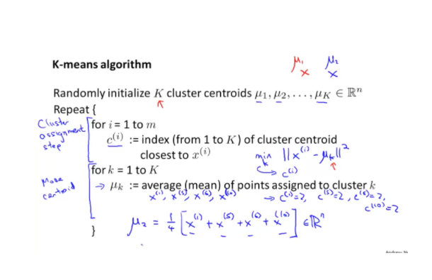

k-means 알고리즘은 2가지 단계로 나누어지는데 첫번째는 Cluster assignment step, 두번째는 Make Centroid step이다.

* Cluster assignment step : 이 단계는 각 data set의 $x^{(i)}$ 에 대해 어느 centroids에서 가장 가까운지 그 index를 찾아 저장하는 단계로 가장 가까운 index는 $c^{(i)}$ 에 저장된다. 예를들어 $c^{(2)}$ 의 값은 2번째 data x에서 가장 가까운 centroids의 값을 의미한다. 이 값을 구하는 방법은 x와 centroids의 distance를 계산하여 제곱한 값으로 측정하는 방식을 사용한다.
* Move centroid : 이제 각각의 data들은 가까운 centroid가 배정이 되었는데, 같은 centroid에 배정된 데이터 들의 평균값을 구해 centroid의 위치를 이동시키는 단계이다. 

위의 두 가지 동작을 반복하여 최적의 clustering을 만들어내는 것이 이 알고리즘의 목표이다.

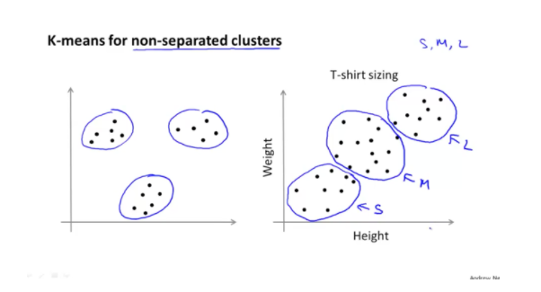

왼쪽의 data set들 처럼 분리가 확실하게 되어 있는경우에는 당연히 k-means 알고리즘이 잘 동작한다. 하지만 오른쪽의 data set 처럼 분리가 되어 있지 않은 경우는 어떨까? 이 경우에도 k-means 알고리즘이 정확히 동작하여 clustering을 성공적으로 할 수 있으니 걱정할 필요가 없다.

## Optimization Objective

이제까지 배웠던 알고리즘은 모두 optimization이 존재했다. k-means에도 이러한 optimization이 존재하며, 이것을 토대로 우리는 두 가지 사실을 생각할 수 있다.

* Optimization 된 결과와 Clustering 된 결과를 비교하여 얼마나 알고리즘이 잘 동작하는 지에 대한 평가 지표가 될 수 있다.
* local optimal 에 빠지지 않을 수 있는 정보가 될 수 있다.(후에 다시 설명)

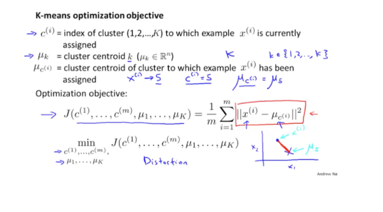

* $c^{(i)}$ : $x^{(i)}$ 에서 가장 가까운 centroid의 index값의 정보를 가짐
* $\mu_k$ : cluster centroid 로써 k개의 centroid로 구성된다.

Optimization objective J함수는 cost function or Distortion 라고 부른다. 이 식은 위처럼 x와 $\mu$의 거리의 제곱의 평균으로 계산한다. 이렇게 만든 cost function을 최소화 하는게 목표이다

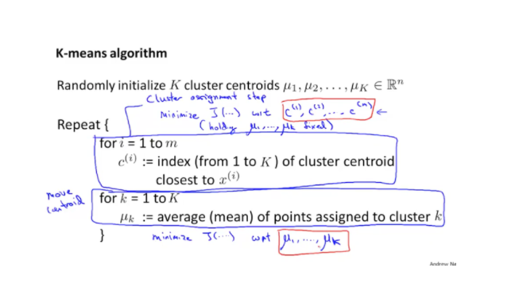

다시한번 k-means 의 알고리즘을 가져와서 보면 첫번째 단계에서는 J함수에서 c1...cm 의 set을 가져와 min한값으로 정확히 업데이트 하는 과정을 하고, 두번째 단계에서는 J함수에서 $\mu$1...$\mu$m 의 set을 가져와 J값을 구해 min한 값으로 업데이트를 하는 과정을 한다고 생각하면 된다.

## **Random initialization**

이제 K-means 의 초기화를 하는 방법에 대해서 알아보겠다. 앞에서 처음 centroids를 pointing 시키는 과정을 random하게 하라고 얘기했었다. 하지만 이 방법에는 단점이 존재한다.

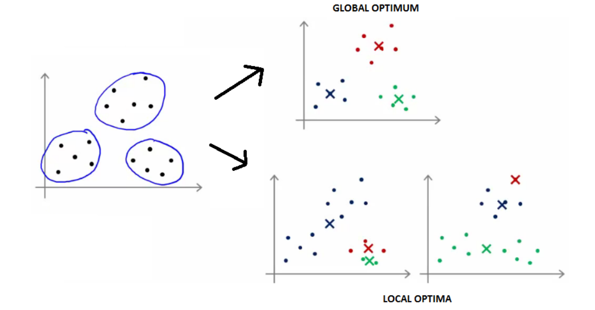

만약 3개의 clustering이 되어야 하는 data set이 있다고 하였을때 제일 위의 결과처럼 global optimal에 도달하는 경우에 있는 반면, 아래의 두 개의 결과는 local optima에 빠진 모습이 된다. 이렇게 되는 이유는 random하게 centroids를 초기화 할 때 비슷한 data끼리 초기화가 된 경우에 발생하는 문제가 되겠다. 그렇다면 이러한 local optima 문제를 해결하는 방법은 무엇일까?

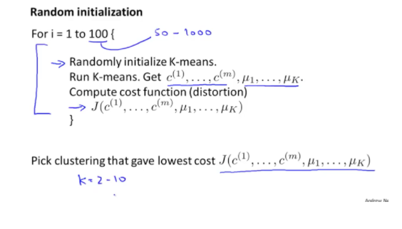

그 방법은 바로 100번의 초기화를 실행해보는 것이다. 100번의 초기화하는 동안 모든 J의 값들을 기록해 두었다가 반복이 끝난 후 가장 작은 J값을 가지는 centroids로 선택하는 방법을 사용하는 것이다.

## Choosing the Number of Clusters

이번에는 Cluster의 개수를 정하는 방법에 대해서 살펴 볼 것이다. 

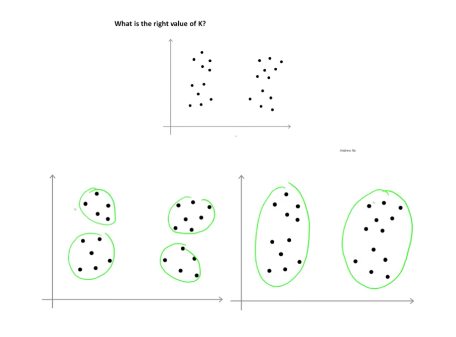

하나의 data set으로도 다양한 k개의 cluster를 만들 수 가 있다. cluster를 고르는 방식을 크게 두 가지로 나누어서 설명할 수 있다.

* Elbow method
* Choosing the value of K

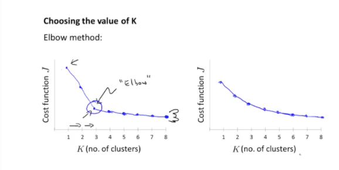

첫 번째 방법은 Elbow 방법인데 k개의 개수를 늘려가며 cost function에 대한 그래프를 그려가며 팔꿈치처럼 꺽이는 부분의 k개수를 사용하는 방식이다. 하지만 이 방식은 오른쪽 그래프처럼 elbow모양이 나오지 않을 수도 있다는 점을 알고 있어야 할 것이다.

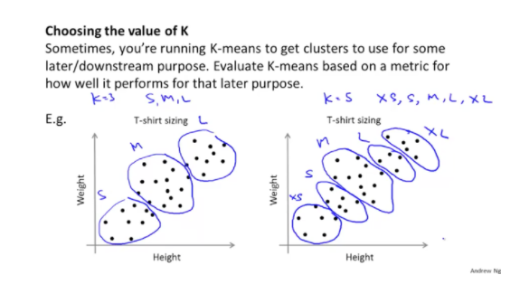

두번쨰 방식은 직접 k의 개수를 선택하는 방법으로 목적에 따라 Clustering 개수를 정하면 된다.

