# 14: Dimensionality Reduction (PCA)

## **Motivation 1: Data compression**

데이터 압축(Data compression)은 말 그대로 데이터를 압축하는 방법으로 머신러닝을 하다보면 수 많은 features 들을 다루게 되는데 그렇게 만들어진 고차원의 데이터들을 적절한 방법의 알고리즘을 통해 저차원의 데이터로 축소하는 방법이다. 이 때 데이터가 축소되면서 최대한 손실이 적도록 압축하는 방식이 필요할 것이다. 

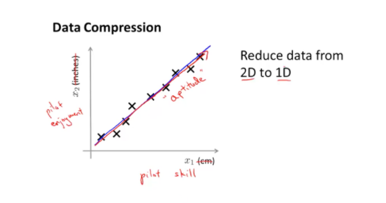

위의 그래프는 x1,x2 feature로 이루어진 2차원데이터를 1차원의 어느 직선에 축소한 모습을 보여준다. 이렇게 축소하여 얻을수 있는 장점은 다음과 같다.

* 메모리와 디스크 사용을 줄일 수 있다.
* 그로인해 머신러닝 총 학습시간을 줄일 수 있다.

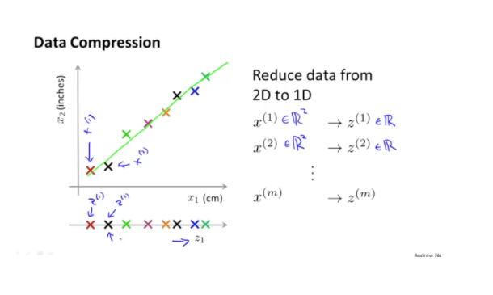

다시 한번 자세하게 정의해보자. 위의 2D 에서 1D로 줄일 때 데이터를 한 직선에 압축시킬 수 있다고 하였다. 즉  2차원 데이터 x 는 1차원 데이터 z로써 매핑이 된다. 예시에서는 2차원의 데이터를 1차원에 데이터로 압축하는 것으로 예시를 들었지만 실제로는 이러한 원리를 이용해서 다른 고차원의 데이터를 저차원의 데이터로 압축할 수가 있다.

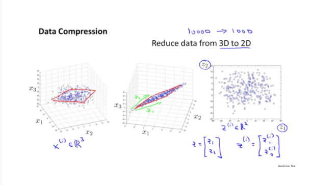

차원 축소에 대한 또 다른 예시로 3차원에서 2차원으로 축소하는 것을 예시로 들어보겠다.

이번에는 직선이 아니라 2차원의 벡터로 이루어진 어떠한 평면으로 데이터들이 압축되어 최종적으로 2차원의 데이터로 표현이 되는 것을 볼 수 있다. 이러한 원리를 이용하여 3차원 이상의 데이터를 그보다 낮은 데이터로 차원 축소를 할 수 있다는 사실에 대해서 배워 보았다.

## **Motivation 2: Visualization**

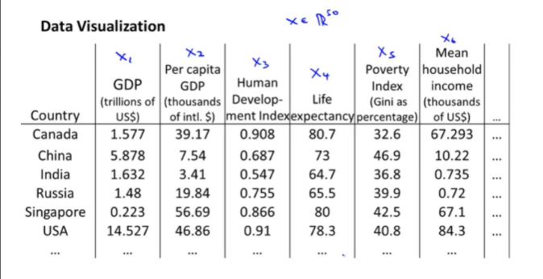

만약 데이터가 위의처럼 50개의 국가에 대한 x features가 주어져 있다고 생각하자. 이 데이터를 분석하기 위해서 visualization하고 싶지만 우리는 3차원 이상의 데이터를 visualization할 수 없기 때문에 3차원 이하의 데이터로 축소시켜서 시각화해야 한다.

예를들어 아래와 같이 차원을 축소시켜 새로운 feature인 z로 매핑하여 데이터를 2차원 평면에 visualization 하는 모습을 볼 수 있다.

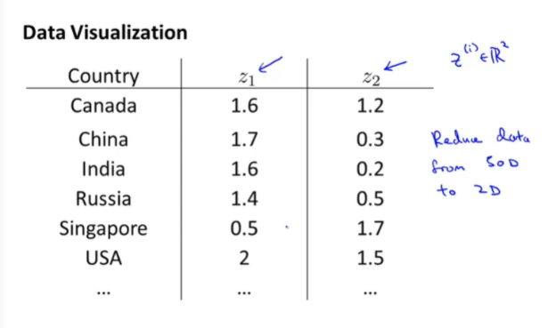

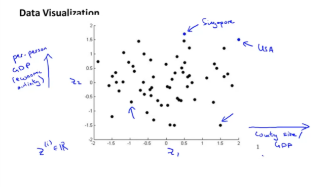

## **Principle Component Analysis (PCA): Problem Formulation**

이제까지 차원 축소에 대한 예시를 들어보았는데 실제로 머신러닝에서 차원 축소에 사용되는 알고리즘인 PCA에 대해서 알아보겠다.

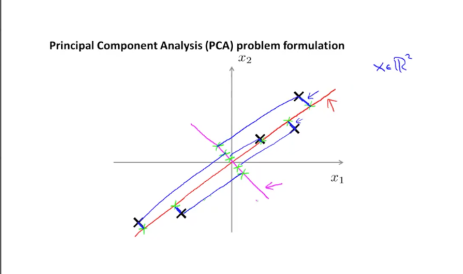

위의 그래프에서 빨간색 직선과 분홍색 직선을 비교해보자.

* Red lines :  데이터들과의 거리가 분홍색 직선보다 짧은 것을 알 수 있다.
* Magenta lines : 데이터들과의 거리가 빨간색 직선에비해 훨씬 긴 것을 알 수 있다.

데이터들이 투영될 직선과 데이터 사이의 거리, 즉 파란색 선으로 표시한 이 거리를 projection error라고 부르겠다. 그리고 우리가 원하는 optimal은 projection error가 가장 작도록 하는 것을 고르는 것이 목표가 될 것이다. 

참고로 위의 직선들 중에서는 빨간색 직선이 분홍색 직선보다 더 optimal한 직선이다.

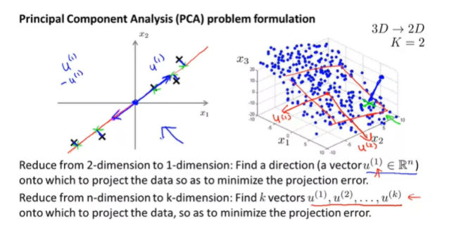

왼쪽 그래프와 같이 2차원의 데이터를 1차원으로 줄일 때에는 하나의 직선을 찾아서 데이터들을 투영해야 한다. 그리고 오른쪽과 같이 3차원의 데이터를 2차원의 데이터로 줄일 때에는 적절한 2차원 평면을 찾아 데이터를 투영시켜야 할 것이다. 

그렇다면 이러한 직선과 평면은 어떤 방식으로 찾을 수 있을지 간단하게 소개하여 보겠다.

* 2D to 1D :  projection error를 최소로 만드는 벡터 u를 찾아 그 벡터로 이루어진 직선을 만든다
* 3D to 1D :  projection ereor를 최소로 만드는 벡터 u를 찾아 그 벡터들로 이루어진 평면 만든다

이러한 원리로 n차원에서 k차원으로 감소하는 문제가 있다면, k개의 벡터를 찾아야 할 것이다.

## **PCA Algorithm**

이제 본격적으로 PCA 알고리즘을 적용하는 방법에 대해서 알아보겠다.

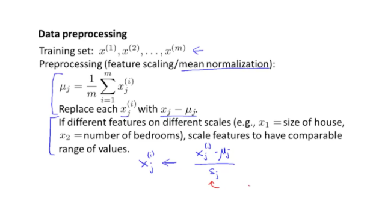

PCA 알고리즘을 수행하기 위한 첫 번째 절차는 바로 data preprocessing 과정이다.

* mean normalization : 데이터 정규화를 통해 x의 값을 업데이트한다
* feature scaling : 만약 데이터들간의 단위가 너무 차이가 많이 날때에는 scaling을 해야한다.

두 번째로는 우리는 벡터 u와 데이터를 새롭게 투영한 feature z를 구해야 할 것이다. 이것을 구하기 위한 방법은 다음과 같다

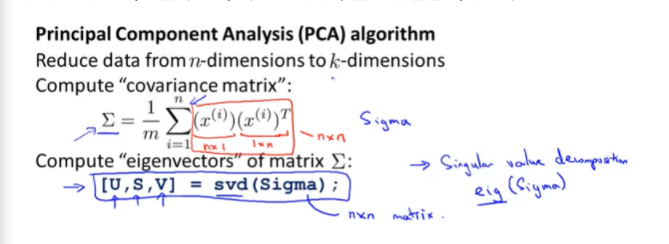

1. Compute "covariance matrix" : 데이터들의 상관관계를 행렬로 표현할 수 있게 공분산 행렬을 구한다. 이 때 공분산행렬을 구하는 공식은 위와 같다.
2. 위에서 구한 행렬을 이용하여 eigenvectors(고유벡터)를 계산한다. 위에서의 예시는 svd를 이용하여 고유벡터를 계산하였다. 

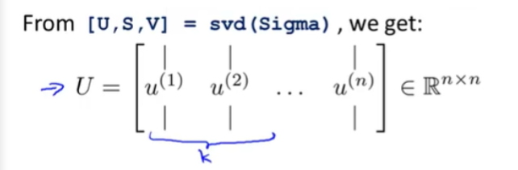

3. 위에서 구한 U벡터의 크기는 n x n 크기가 될 것이다. 우리는 여기에서 줄이고 싶은 차원의 크기 즉 k열 만큼의 matrix만을 쓸 것이고 그 matrix를 $U_{reduce}$ 라고 정의하겠다.
4. 이렇게 구한 값들을 이용하여 z vector 를 연산할 수 있다. z = ($U_{reduce}^T$*x) 의 공식으로 구할 수 있다.

## **Applying PCA**

## Reconstruction from Compressed Representation

이렇게 차원을 축소하여 z에대해 새롭게 x들을 투영하는 것에 대해 배웠다. 이번에는 축소된 k차원에서 다시 n차원으로 reconstruction 하는 방법에 대해서 알아보겠다.

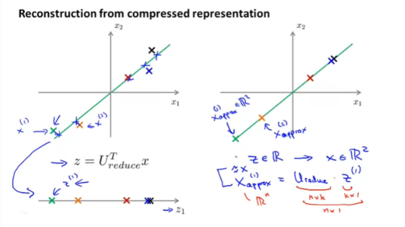

위에서 우리는 z에 대한 공식을 구했었다. 이 공식을 이용해서 x만 남기게 되면 x = $U_{reduce}$z

가 되는데 축소되었다가 다시 확장한 x의 값은 이전의 x와 100프로 일치하지 않기 때문에 이렇게 reconstruction 된 x를 x(approx) 라고 정의하겠다.

## **Choosing the number of Principle Components**

그렇다면 축소해야 하는 차원 k를 어떻게 정할 수 있는지에 대해서 알아보겠다.

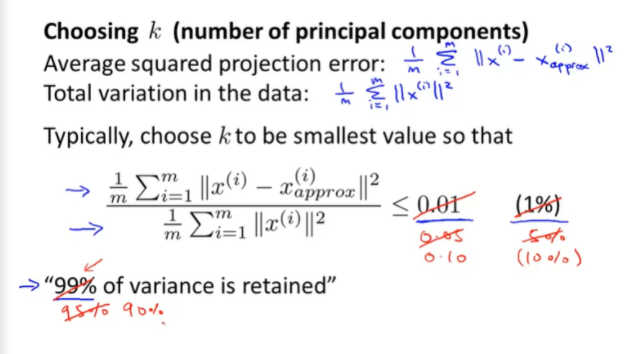

이제까지 배웠던 두 가지 공식을 통해 차원 k를 정할 수 있다.

* Average squared projection error
* Total variation in the data

이 두개의 공식의 비율이 0.01 보다 작다. 즉 오류율이 0.01이고 나머지 99.9 는 variance가 보존된다. 이러한 비율은 0.05, 0.10 등 수정하여 적절히 사용하면 된다.

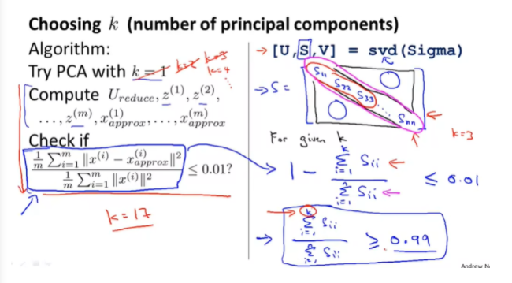

이 공식을 통해 k=1부터 k를 점차 올려가면서 위의 식에 만족하는 k 값을 찾을 때 까지 반복하는 방법을 사용할 수 있다. 하지만 이러한 방식을 사용하면 효율이 좋지 않다. 이보다 더 효율이 좋은 방법은 svd(Sigma) 결과에 대한 값 중 S matrix의 대각성분에 대한 공식을 통해 오른쪽 그림의 공식을 사용하면 더 효율으로 k의 값을 찾을 수 있을 것이다.

