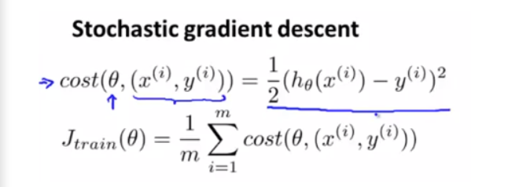

# 17: Large Scale Machine Learning

이제까지 우리는 여러 머신러닝 기법에 대해서 배웠다. 이러한 머신러닝은 최근들어 더 높은 효율을 내고 있다. 그 이유는 바로 training data의 수가 엄청나게 많아졌기 때문이다. 지금까지는 상대적으로 적은 양의 data set에 대해서 머신러닝을 적용하는 방법에 대해서 공부하였고 오늘은 실제로 large scale 의 데이터를 머신러닝에 적용하는 방법에 대해서 공부하여 보겠다.

## **Learning with large datasets**

위의 그림은 이전에 한 번 공부했던 적이 있는 그림이다. 그래프를 보면 여러 알고리즘이 존재하지만 그 알고리즘에 대한 정확성은 서로 비슷비슷 하다. 성능이 차이나는 것은 결국 데이터의 사이즈에 달려있는 것을 알 수 있다. 즉 우리는 머신러닝의 성능을 높히기 위해서 Large size 의 데이터를 학습할 수 있어야 한다. 

예를들어 위와 같은 엄청나게 큰 양의 데이터가 있다고 가정해보자. 우리는 이 데이터들의 cost를 계산하여 그 cost를 최소화 시키기 위해 경사하강법(Gradient Descent Algorithms) 을 사용하여 매번 파라미터를 업데이트 시키는 과정을 반복하였다. 다만 이렇게 큰 사이즈의 데이터를 위와 같이 동일하게 동작시킨다면 엄청나게 큰 계산비용이 요구될 것이다. 

그렇다면 이러한 데이터를 효율적으로 학습하는 방법이 있을까? 그에 대한 아이디어는 바로 전체 데이터 중에 적당한 양의 데이터를 임의로 골라 학습을 하는 것이다. 구체적인 예를 들어 설명하면 다음 과 같다.

* 데이터  사이즈 m(100,000,000)
* 임의로 1000개의 데이터를 추출
* 추출한 일부 데이터만으로 학습을 진행
* Learning Curves 를 그려 학습이 잘 진행되고 있는지 확인
  * 만약 성능이 좋다면 전체 데이터를 학습할 필요는 없다.
  * 성능이 좋지 않다면 feature을 추가하거나 hidden unit을 추가하는 방식을 사용.

왼쪽과 같은 learning curve가 그려지면 high  variance 문제이고 오른쪽과 같은  curve가 그려지면 high bias 문제임을 인식할 수 있고, feature를 추가하거나 hidden unit을 추가하는 방식 등 진단에 따른 조치를 취해가며 학습을 진행하면 된다.

## **Stochastic Gradient Descent**

우선 우리가 기존에 사용하던 Gradient Descent 방식은 다음과 같다.

학습을 진행함에 따라 결국 파라미터 $\theta$ 은 global optimal한 값으로 수렴하였다. 하지만 이 방식을 데이터의 크기가 엄청 클 때에 적용하면 계산의 비용이 어마어마 해지는 문제가 있다. 이렇게 gradient를 모든 training data에 대해서 계산하는 방식을 Batch Gradient Descent라 정의한다. 즉 Batch방식을 사용하면 large data set 에 대해서는 성능을 기대할 수 없다는 의미이다.

Stochastic gradient descent 알고리즘음 위와 같고, 이전에 Batch 알고리즘에서는 모든 데이터에 대해 cost를 계산하였다면, 여기서는 하나의 data의 cost를 계산하는 것이 주요 아이디어이다.

 알고리즘의 동작과정은 다음과 같다.

* 훈련 데이터를 무작위로 섞는다
* 각각 하나의 training data에 대한 gradient descent를 적용하여 parameter를 업데이트 한다
* 1~m 까지 위의 동작들을 반복수행한다

위의 알고리즘을 사용하면 계산에 대한 비용은 확실히 줄어들 것이다. 다만 오른쪽 그래프에서 분홍색과 같은 모습으로 학습이 될 것이다. global optimal에 항상 수렴하지는 않고 그의 근사값에서 머무르게 될 것이다. 비록 정확한 값으로 도달하지는 않지만 근사한 값으로 도달하고, 기존의 Batch알고리즘에 비해 성능은 조금 낮지만 연산비용와 속도를 향상시키는 이점을 가진다.

## **Mini Batch Gradient Descent**

다음으로는 Mini Batch 방식에 대해 알아보겠다. 이제까지 나온 방식을 정리하며 새로운 방식을 정의해 보겠다.

* Batch : 모든 데이터에 대해서 학습을 진행
* Stochastic : 하나의 데이터를 통해 학습을 진행
* Mini Batch : 적당한 수의 데이터를 통해 학습을 진행

Mini Batch는 적당한 수의 데이터를 임의로 선택하여 학습을 진행하고 예시로 10개의 데이터를 임의로 선택하였을 떄의 알고리즘 동작을 살펴보자.

1000개의 데이터 중 임의로 10개의 데이터를 골라 Gradient descent를 진행하였다.

이 방식을 사용하면 Stocastic 방식보다 효율은 확실히 좋아질 것이다. 하지만 batch 사이즈는 사람이 직접 조절해야 하는 hyper parameter이기 때문에 직접 좋은 batch 사이즈를 찾아 사용해야 한다는 것이다.

## **Stochastic gradient descent convergence**

이번에는 Stochastic 알고리즘이 optimal 한 값으로 수렴하고 있는지 확인하는 방법에 대해서 알아보겠다. 기존의 Batch 알고리즘에서 우리는 매 반복마다 cost가 줄어드는 그래프를 그려 학습이 정확히 진행되고 있는지 확인하였다.

이번에는 매번 확인하는 것이 아니라 1000번에 반복마다 cost대한 평균을 확인하는 방식을 사용한다.

위의 4개의 그래프들은 각각 다른 Learning rate, checking size 에 따라 다른 형태의 그래프 모양이 주어진다.  왼쪽위의 그래프부터 시계방향으로 각각의 그래프를 A,B,C,D라고 한다면

* A 그래프 : 파랑색 보다 빨간색의 learning rate가 작은 모습. 
* B 그래프 : 파란색은 1000번마다 평균, 빨간색은 5000번마다 평균을 낸 그래프로 빨간색 그래프가 곡선에 가까운 형태
* C 그래프 : 1000번 마다 평균을 낸 파란색 그래프의 노이즈가 심해서 학습의 진행여부를 파악하기 힘들다. 빨간색 그래프처럼 5000번마다 평균을 내면 학습의 진행여부를 쉽게 알 수 있는 모양이 나옴.
* D 그래프 : Cost 가 줄어들지 않고 발산하는 모습. 적은 learning rate를 사용하면 된다.

즉 그래프를 그려본 후 그래프의 개형에 따라 문제점을 진단한 후 평균을 내는 횟수를 증가시키거나 learning rate를 수정하여 문제점을 해결하는 방식을 사용하는 것이 Stochastic Gradient Descent 방식이다.

이제 Stochastic gradient descent 에서 learning rate를 다루는 방식에 대해서 설명하겠다. 오른쪽 그래프처럼 parameter는 global minimum에 수렴하는 것이아니라 그 근처의 값에서 왔다갔다 맴도는 모습이라고 얘기했었다. 이러한 문제를 해결하기 위한 방식이 바로 고정되지 않는 alpha 값을 사용하는 것인데, 그림에서 주어진 공식을 사용하면 반복횟수가 커질수록 alpha 값은 작아지는 형태로 learning rate를 설정하게 되면, 아래와 같은 그림처럼좀 더 global minimum에 가깝게 수렴하는 것 같은 모양의 학습을 하게 된다.

## Online Learning

머신러닝의 기법 중 하나인 Online Learning 기법에 대해서 알아보자. 데이터가 실시간으로 들어오는 상황에서 학습을 진행하는 방식으로 기존에 사용하는 고정된 데이터들을 학습하는 것이 아니라 새롭게 들어오는 데이터에 대해서 실시간으로 학습하는 방식의 머신러닝 기법이다.

Online learning 알고리즘의 한가지 예시를 들어보자면 다음과 같이 배송 서비스 업체가 고객에게 출발지와 도착지를 받으면 그에 따른 배송비를 책정하여 고객에게 배송 서비스 이용에 대한 대답을 들을 수 있다. 서비스 이용하면 y=1 이용하지 않으면 y=0의 형태로 받을 수 있다. 이 알고리즘은 실시간으로 고객들의 정보를 학습하고 계속해서 데이터가 들어오는 이유로 이전의 데이터는 폐기한다. 이렇게 실시간으로 고객의 선호에 따른 training set을 학습시키면 알고리즘의 성능이 훨씬 좋아질 것이기 때문이다.

## **Map reduce and data parallelism**

마지막으로 배워볼 기술은 여러개의 컴퓨터에서 동시에 머신러닝을 진행하는 방식에 대해서 배워볼 것이다. 지금까지 배웠던 알고리즘들은 하나의 컴퓨터에서만 동작하는 방식을 사용하였는데 앞으로 용량이 엄청 큰 데이터를 다룰 때 여러 컴퓨터에서 동시에 실행할 수 있는 방식을 적용할 수 있다면 더 효율이 좋을 것이다. 아래와 같은 방법을 사용할 수 있다.

우리가 m=400을 가지고 있다고 가정했을 때, 4개의 컴퓨터로 각각 100개의 example로 나누어서 사용하겠다는 의미이다. 총 4대의 컴퓨터가 각각 100개의 data로 학습을 진행한 후 진행 결과를 temp 변수에 임시 저장한 후에 master server 에 결과를 각각 전달하여 통합한 결과로 parameter를 업데이트하는 방식을 사용하면 된다.

이것을 그림으로 나타내면 위와 같은 모습이 된다. Batch 알고리즘을 사용할 때 너무 큰 데이터라면 위와 같은 Map- reduce 방식을 사용하여 병렬적으로 학습 데이터를 나누어서 학습할 수 있다.

